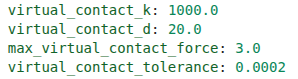
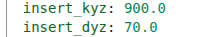
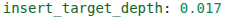
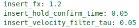
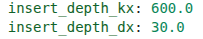

## 2.引入强化学习（非预设轨迹）

### 20260811v1——基于SAC算法仅引入于SEARCHING状态的强化学习轴孔装配任务

v1版本的SAC算法非预设轨迹轴孔装配任务：
[openarm_gazebo_hole_search_SAC_backup_20260810_144802.zip](openarm_gazebo_hole_search_SAC_backup_20260810_144802.zip)

前提：**无力传感器、无视觉传感器，SAC算法不知道孔每一轮的位置**。
```text
复位       → 普通控制
保持稳定   → 普通控制
靠近板面   → 普通控制
寻找孔     → SAC
插入       → 普通控制
插入后保持 → 普通控制
```
#### 阶段一：复位（Reset）
每一个新Episode开始，机械臂的七个关节都要回到一个固定的准备姿态，满足以下条件：
（1）关节位置误差足够小：

<div align="center">

$$
\max |q-q_{target}|\leq0.01\text{ rad}
$$

</div>

（2）关节速度足够小：

<div align="center">

$$
\max |\dot q|\leq0.10\text{ rad/s}
$$

</div>

表明机械臂已经停稳了。
复位机械臂关节的同时，孔洞位置还会同步随机放置，即复位后每一个Episode机械臂的初始位置都是一样的，但是孔洞的位置是随机的。

#### 阶段二：保持稳定（HOLDING）
机械臂稳定后，目前是设定了保持5秒的稳定，在进入后续的状态。

#### 阶段三：靠近板面（APPROACHING）
目前建立的坐标系xyz
```text
X方向：往孔里面插
Y方向：板面左右搜索
Z方向：板面上下搜索
```
APPROACHING阶段在X方向完成，找孔阶段在YZ平面完成。
APPROACHING/SEARCHING阶段，机械臂在X方向施加1N的力（0N —> 1N缓慢增加）。
目前程序并不是靠真实轴和板发生刚体碰撞来判断接触，而是使用一个虚拟板面弹簧阻尼模型，当轴到了这个位置以后便会产生虚拟反力。
虚拟板面的模型大概为：

<div align="center">
      
$F=Kx+Dv$

</div>

```
弹簧刚度 K = 1000 N/m
阻尼 D = 20 N·s/m
最大虚拟反力 = 3 N
```
当在某一个控制周期（控制器500Hz）内被判断“连续触碰0.2秒”，则可以认为已经到了板面，APPROACHING状态结束。



若一直在APPROACHING阶段超过12秒还没进入下一阶段，则进入FAULT。

#### 阶段四：SAC搜索控阶段（SEARCHING）
进入SEARCHING阶段后，先记录目前轴尖的位置，并标记为$Y_0$，$Z_0$，并将此作为搜索中心，并记

<div align="center">
      
$$
Y_{ref}=Y_0
$$

$$
Z_{ref}=Z_0
$$

</div>

后续SAC算法会根据策略不断告诉机械臂：
```text
下一小步的 Y 方向往哪走？
下一小步的 Z 方向往哪走？
```
**（1）SAC的动作空间**

<div align="center">
      
$a_t=[a_Y,a_Z]$

</div>

其中$a_Y$，$a_Z$的范围都是[-1,1]，表示下一部动作朝Y、Z的正/负方向移动的权重。
$a_Y$,$a_Z$只是表示下一步的动作，而并非真实移动的距离，目前v1方案使用的是**位置增量**的方法，就是设定一个最大的动作步长
$\Delta{a_{yz}}=0.2mm$
，即

<div align="center">
      
$$
\Delta{Y}=\Delta{a_{yz} a_Y}
$$

$$
\Delta{Z}=\Delta{a_{yz} a_Z}
$$

</div>

也就是说，假如SAC本轮策略给出的动作是[0.5,-0.8]，则机械臂这一次动作在YZ平面上的实际移动距离为

<div align="center">
      
$$
\Delta Y=+0.1\text{ mm}
$$

$$
\Delta Z=-0.16\text{ mm}
$$

</div>

需要注意的就是，SAC策略给出的动作是以增量的形式，也就是说是从当前参考点一点一点计算，而不是重新冲轴尖初始位置进行计算，所以SAC本质上是在一点一点走路。
目前SAC策略控制频率为**20Hz**，也就是说**SAC每0.05秒策略就会给出一个动作**。
与机械臂底层控制器500Hz（每0.002秒一个指令）的联系：
**SAC给出一个动作对应的位置信息以后，机械臂并非瞬移过去，而是在SAC给出动作后到下一个动作给出前的这0.05秒周期内，机械臂在0.05/0.002=25这25个指令控制周期内，每0.002秒更新一次关节状态，努力平滑地运动到目标的位置。**
```text
SAC：20 Hz 决定“往哪里走”
↓
低层控制器：500 Hz 决定“怎么稳定地走过去”
```
**（2）SAC的工作空间**
搜索区域的相对起点为：

<div align="center">
      
$$
Y_0 \pm 4mm
$$

$$
Z_0 \pm 4mm
$$

</div>

而训练阶段的孔洞随机生成位置为：

<div align="center">
      
$$
Y_0 \pm 3mm
$$

$$
Z_0 \pm 3mm
$$

</div>

一个Episode搜索最大时间为20秒，搜索最大动作为400步。
SAC不知道孔洞的真实位置，因此SAC只能根据
```text
自己已经怎么运动
哪些区域已经走过
现在速度如何
还剩多少时间
```
形成搜索策略。

**（3）SAC搜索历史**
进入SEARCHING阶段后，SAC会将整个搜索区域划分为9X9的格子地图，走过的地方标记为1，没走过的地方标记为0，避免SAC后期依旧重复来回走。

**（4）SAC奖励函数**
| 情况 | 奖励 |
|---|---:|
| 每走一步 | `-0.01` |
| 进入一个没搜过的新格子 | `+0.05` |
| 重复进入已经搜过的区域 | `-0.02` |
| 动作快速大角度反向 | `-0.05` |
| 靠近搜索边界 | `-0.10` |
| 找到孔 | `+20` |
| 最终完整装配成功 | `+100` |
| 搜索越界 | `-5` |
| 控制器严重故障 | `-30` |
| 搜索超时 | `-10` |

**（5）找到孔的判定依据**
轴的尺寸：直径6mm，孔的尺寸：7mmX7mm方形。
SAC不知道真实孔的位置，但是仿真环境知道真实孔的具体位置，判定依据如下：

<div align="center">
      
$$
|Y-Y_{hole}|\le0.5mm
$$

$$
|Z-Z_{hole}|\le0.5mm
$$

</div>

其中$Y$、$Z$为轴心，$Y_{hole}$、$Z_{hole}$为孔心。当满足上述条件以后，判定为找到孔心，此时SAC不再控制机器人，进入INSERTING阶段，交回底层控制器负责后续插入。

#### 阶段五：插入（INSERTING）
当在SEARCHING阶段搜索到孔的位置后，**控制器就会将当前YZ方向坐标牢牢控制在孔中心**，然后在X方向上慢慢将轴插入。
**（1）在YZ方向上**
虽然在插入阶段，理论上是将机械臂的YZ方向坐标固定在孔中心，但是现实中插入阶段仍会有晃动，因此在YZ方向上会对机械臂进行控制。
对机械臂在YZ方向上采用了**位置刚度**和**阻尼**进行控制：
目前
```text
Y/Z位置刚度 = 900 N/m
Y/Z阻尼 = 70 N·s/m
```



**位置刚度：偏离孔中心以后，控制器有多强烈地把它拉回来**。位置刚度越大，偏1mm的拉回力就越大。但是并非越大越好，如果太大的话会纠偏很快，而且在数值/动力学上来不及跟上就容易振荡。
**阻尼：给运动“踩刹车”**。
因此刚度和阻尼有以下关系：
```text
刚度 K
→ 决定“多想回到目标”

阻尼 D
→ 决定“回去的时候有多克制”

K太大、D太小
→ 特别容易抖

K太小
→ 软、跟踪慢

D太大
→ 动作迟钝
```
**（2）在X方向上**
目标深度为17mm



在插入时X方向的基础推力为1.2N，但是并非固定1.2N插入，加入了深度位置控制。



在插入时会检查“目前已经插入多少”。如果距离目标很远则继续往里推；如果越来越接近17mm，推力逐渐调整；如果已经插得太深，则允许产生轻微反向力拉回来。
目前该版本X方向上的深度控制参数：
```text
X深度刚度 = 600 N/m
X深度阻尼 = 30 N·s/m
```



X方向上的深度刚度也不能过大，过大则容易插深差一点控制器就猛推，然后控制器又反拉，后面又猛推、反拉....，形成了前后振荡。
因此**后续分析插入阶段晃动的原因时可以尝试调整YZ方向上的位置刚度、阻尼以及X方向上的深度刚度和深度阻尼**。

除了在XYZ方向上的刚度、阻尼有设定以外，INSERTING阶段还在X方向上的插入力有**限幅
保护**，即最大的X力限制在 $\pm{2.5N}$，YZ方向上的横向合力最大限制在 ${4N}$。

**（3）插入完成的判定条件**
插入完成要同时满足以下条件

<div align="center">
      
$$
depth \ge 17mm
$$

$$
最大关节速度 \leq 3 rad/s
$$

$$
工具速度 \leq 0.25 m/s
$$

$$
以上动作同时连续保持0.05 秒
$$

</div>

只有**以上条件同时满足**了，才能从INSERTIN进入到INSERT_HOLDING状态。

#### 阶段六：插入后保持（INSERT_HOLDING）
此时机械臂会调用MIT算法系统锁定当前关节姿态，然后维持2秒。
**此时会再做一次验收，确定最终是assembly_success还是insertion_failure**
```text
深度至少16.9mm
轴的倾斜角必须小于等于1.5°
轴尖的位置Y/Z每个方向距离孔壁至少小于等于0.5mm
板面入口处必须还处于孔允许的范围内，整根轴进入板面的位置也不能斜得跑出孔
```
**以上条件全部满足**后，则判定为assembly_success，Episode结束；若以上条件不都全部满足，则判定为insertion_failure，Episode结束。

**完整的一个Episode如下：**
```text
抽一个随机孔位置
      ↓
机械臂回到准备姿态
      ↓
等待机械臂稳定
      ↓
沿 X 方向慢慢顶向板面
      ↓
连续 0.2 s 确认已经接触板面
      ↓
进入 SEARCHING
      ↓
SAC 每 0.05 s 看一次当前状态
      ↓
输出 Y/Z 两维动作
      ↓
最大每轴移动 ±0.2 mm
      ↓
低层控制器以 500 Hz 追踪这个目标
      ↓
继续观察 → 再动作 → 再观察
      ↓
如果越界/超时 → 失败
      ↓
如果对准真实孔 → 找孔成功
      ↓
SAC停止工作
      ↓
规则控制器保持 Y/Z 孔中心
同时沿 X 插入
      ↓
插到 17 mm 且稳定
      ↓
保持 2 秒
      ↓
检查深度、偏心、倾角
      ↓
成功 / 失败
```

**当前版本的SAC主要参数：**
| 参数 | 当前值 | 你可以怎么理解 | 调大通常会怎样 |
|---|---:|---|---|
| `learning_rate` | 0.0003 | 学习步长 | 学更快，但更容易不稳定 |
| `gamma` | 0.99 | 重视未来程度 | 更看重长期结果 |
| `tau` | 0.005 | Target 网络追随速度 | Target 更新更快、稳定性可能下降 |
| `batch_size` | 256 | 每次学习多少经验 | 梯度更平滑、计算更多 |
| `buffer_size` | 1,000,000 | 经验池容量 | 保留更多历史经验 |
| `learning_starts` | 5000 | 学习前先随机收集多少步 | 随机探索阶段更长 |
| `train_freq` | 1 | 多久训练一次 | 数值变大后训练频率降低 |
| `gradient_steps` | 1 | 每次训练几次 | 学得更密集，也更可能过拟合当前 buffer |
| `ent_coef` | auto | 探索强度 | 当前自动学习 |
| `target_entropy` | -2 | 希望保持的随机程度 | 会影响自动 α |
| 网络 | 256×256 | 模型容量 | 更大能表达复杂策略，但训练更重 |

**当前版本与SEARCHING阶段相关的参数：**
| 参数 | 当前值 | 直接影响 |
|---|---:|---|
| SAC 动作周期 | 0.05 s | 每秒决定多少次 |
| SAC 频率 | 20 Hz | 同上 |
| 最大动作步长 | ±0.2 mm/轴 | 每次 reference 能跳多远 |
| 搜索范围 | ±4 mm/轴 | 最大搜索区域 |
| 最大搜索时间 | 20 s | 一回合允许搜索多久 |
| 最大搜索步数 | 400 | SAC 最多行动几次 |
| Y/Z 搜索刚度 | 80 N/m | 机械臂多积极追 SAC reference |
| Y/Z 搜索阻尼 | 30 N·s/m | 追踪时抑制振荡 |
| X 搜索推力 | 1 N | 轴压在板面的力度 |


#### 启动仿真、训练、测试以及日志打包

因为强化学习基于python语言，因此要**进入conda环境**中执行（conda环境已经配置好了相关的依赖）
```python
conda activate openarm
source /opt/ros/humble/setup.bash
source ~/openarm_ws/install/setup.bash
cd ~/openarm_ws
```
**终端 A 启动仿真：**
```python
cd ~/openarm_ws
source /opt/ros/humble/setup.bash
source install/setup.bash

cd ~/openarm_ws/src/openarm_gazebo_hole_search_SAC
bash scripts/run_sac_sim_logged.sh
```
**若要同时打开RViz模型，则运行以下仿真指令：**
```python
cd ~/openarm_ws
source /opt/ros/humble/setup.bash
source install/setup.bash

cd ~/openarm_ws/src/openarm_gazebo_hole_search_SAC
bash scripts/run_sac_sim_logged.sh rviz:=true
```
**终端 B 开始正式训练：**
```python
cd ~/openarm_ws
source /opt/ros/humble/setup.bash
source install/setup.bash

cd ~/openarm_ws/src/openarm_gazebo_hole_search_SAC
bash scripts/run_sac_training_logged.sh
```
**终端B开始正式测试：**
```python
cd ~/openarm_ws
source /opt/ros/humble/setup.bash
source install/setup.bash

cd ~/openarm_ws/src/openarm_gazebo_hole_search_SAC

conda run --no-capture-output -n openarm \
env PYTHONPATH=$PWD \
python -u scripts/test_sac.py
```
**如果把测试终端输出也单独保存成日志：**
```python
cd ~/openarm_ws
source /opt/ros/humble/setup.bash
source install/setup.bash

cd ~/openarm_ws/src/openarm_gazebo_hole_search_SAC

conda run --no-capture-output -n openarm \
env PYTHONPATH=$PWD \
python -u scripts/test_sac.py 2>&1 | tee sac_results/logs/testing.log
```
**只打包仿真、训练、测试日志：**
```python
cd ~/openarm_ws/src/openarm_gazebo_hole_search_SAC

tar -czf sac_logs_$(date +%Y%m%d_%H%M%S).tar.gz \
sac_results/logs
```
**把日志 + 测试结果一起打包：**
```python
cd ~/openarm_ws/src/openarm_gazebo_hole_search_SAC

tar -czf sac_debug_$(date +%Y%m%d_%H%M%S).tar.gz \
sac_results/logs \
sac_results/testing
```
**如果 sac_results/testing 还不存在，就先只打包日志：**
```python
tar -czf sac_logs_$(date +%Y%m%d_%H%M%S).tar.gz sac_results/logs
```
